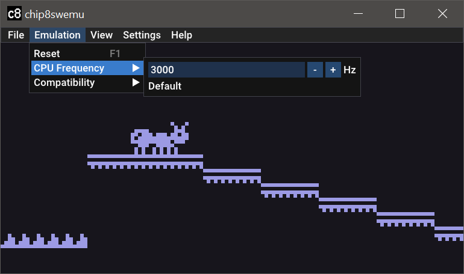
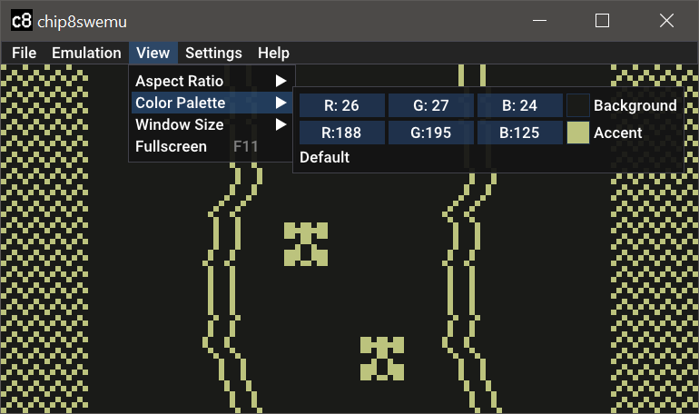
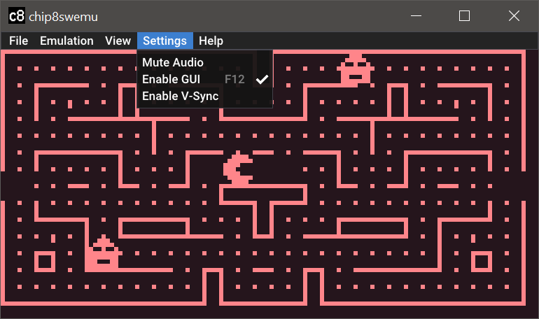

 
# chip8swemu-sdl2

*Multiplatform CHIP-8 and Super-CHIP emulator.*

 | 
:--------------------: | :--------------------:
 | 

## Features

chip8swemu-sdl2 is a port of [chip8swemu](https://github.com/AlfonsoJLuna/chip8swemu) for the desktop based on [SDL2](http://libsdl.org) and [Dear ImGui](https://github.com/ocornut/imgui). 

* Frontend compatible with Windows and Linux.
* Configurable CPU clock rate, 840Hz by default.
* Configurable color palette, black and white by default.
* Compatibility modes for games that require special settings.
* ROM files can be passed as an argument or dropped to the window.
* Native file selection dialog (only available on Windows).

## Releases

* Windows: [chip8swemu-v1.2.0-win64.zip]()
* Linux: [chip8swemu-v1.2.0-linux64.tar.gz]()

## Building

### How to build on Linux (Ubuntu)

1. Clone this repository, including the submodules: `git clone --recurse-submodules https://github.com/AlfonsoJLuna/chip8swemu-sdl2`
2. Install SDL2 development libraries: `sudo apt-get install libsdl2-dev`
3. Open a terminal in the root folder of the repository and type: `make`

### How to build on Windows

1. Clone this repository, including the submodules: `git clone --recurse-submodules https://github.com/AlfonsoJLuna/chip8swemu-sdl2`
2. [Download](https://gnutoolchains.com/mingw64/) and install the mingw-w64 toolchain. Be sure you check `Add to PATH` during installation.
3. [Download](https://www.libsdl.org/release/SDL2-devel-2.0.22-mingw.zip) SDL 2.0.22 libraries for MinGW and extract them to `chip8swemu-sdl2/libraries/SDL2-2.0.22/...`
4. Open a terminal in the root folder of the repository and type: `mingw32-make`
5. Copy the `SDL2.dll` file from `chip8swemu-sdl2/libraries/SDL2-2.0.22/x86_64-w64-mingw32/bin/` to `chip8swemu-sdl2/build/`
